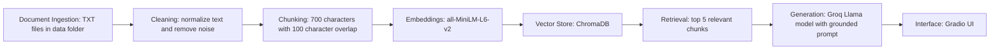

Copy this into your `planning.md` file:

# CSU East Bay Professor Reviews RAG System — Planning Doc

Use this file to record your design decisions as you work through the lab.
There are no wrong answers. Write enough that you could explain your reasoning to another group.

---

## Domain

Student reviews of professors and CS-related classes at CSU East Bay.

I chose this domain because official course catalogs explain what each class covers, but they usually do not explain what students actually experience with each professor. Student reviews can help answer practical questions about teaching style, workload, exam difficulty, grading fairness, feedback quality, lecture clarity, and whether students recommend taking a class with that professor.

This information is hard to find because it is spread across different places like Rate My Professors, Reddit threads, Quora posts, and informal student conversations. My system will make this information searchable so students can ask plain-language questions and receive grounded answers based on the documents I collected.

---

## Documents

1. `data/csueb_christopher_smith_cs471_reviews.txt`
   Source type: Rate My Professors
   Topic: CS471 workload, projects, grading, and teaching style

2. `data/csueb_professor_2081984_cs_reviews.txt`
   Source type: Rate My Professors
   Topic: CS221 and CS321 teaching style, grading, workload, and lecture clarity

3. `data/csueb_indira_cs_reviews.txt`
   Source type: Rate My Professors
   Topic: CS311, CS431, and CS201 teaching style, lecture clarity, homework, and student experience

4. `data/csueb_professor_2114367_reviews.txt`
   Source type: Rate My Professors
   Topic: Professor teaching style, workload, exams, grading, and student experience

5. `data/csueb_professor_2244296_reviews.txt`
   Source type: Rate My Professors
   Topic: Computer Science professor reviews and course experience

6. `data/csueb_reddit_professor_quality_thread.txt`
   Source type: Reddit
   Topic: General student opinions about professor and class quality at CSU East Bay

7. `data/csueb_quora_cs_program_context.txt`
   Source type: Quora
   Topic: CSU East Bay Computer Science program quality, faculty, evening classes, and career preparation

8. `data/csueb_quora_faculty_quality_general.txt`
   Source type: Quora
   Topic: General CSU East Bay faculty quality, reputation, affordability, and campus experience

9. `data/csueb_greg_brueck_general_review.txt`
   Source type: AcademicJobs professor ratings
   Topic: General professor teaching style and student support

10. `data/csueb_hasan_tahir_general_review.txt`
    Source type: Rate My Professors
    Topic: General professor teaching style, exam preparation, office hours, and student support

---

## Chunking Strategy

**Chunk size:**
Around 500 characters per chunk.

**Overlap:**
Around 100 characters of overlap between chunks.

**Why this strategy fits professor review text:**
Most of my documents are short student reviews or short comment-style sources. A smaller chunk size works better because each review usually focuses on one professor, one class, or one student experience. I do not want one chunk to mix too many unrelated ideas, such as teaching style, campus reputation, grading, and workload, because that could make retrieval less precise.

The 100-character overlap helps preserve context when a review is split between two chunks. For example, if a student mentions a professor’s name in one sentence and then explains the workload in the next sentence, overlap makes it more likely that the retrieved chunk still contains enough context to answer the question.

---

## Retrieval Approach

I will use `sentence-transformers/all-MiniLM-L6-v2` to create embeddings locally. This model is a good fit because it is free, runs locally, and works well for semantic similarity on short text.

I will use ChromaDB as the vector store. Each chunk will be stored with metadata, including the source file name and chunk index, so the system can cite where the answer came from.

I will retrieve the top 5 chunks for each query. Five chunks should give the LLM enough context to answer without overwhelming it with unrelated information.

If this were a production system, I would compare embedding models based on retrieval accuracy, cost, latency, context length, and how well the model handles informal student-review language.

---

## Retrieval Observations

After implementing retrieval, I will test these queries and record what comes back:

| Query                                                              | Top result source                    | Does it make sense?                  |
| ------------------------------------------------------------------ | ------------------------------------ | ------------------------------------ |
| What do students say about Professor Christopher Smith’s workload? | To be filled after retrieval testing | To be filled after retrieval testing |
| What do students say about Professor Indira’s lecture style?       | To be filled after retrieval testing | To be filled after retrieval testing |
| What do students say about grading in CS221?                       | To be filled after retrieval testing | To be filled after retrieval testing |
| Is CSU East Bay’s CS program respected by students?                | To be filled after retrieval testing | To be filled after retrieval testing |
| Which professor gives clear exam preparation advice?               | To be filled after retrieval testing | To be filled after retrieval testing |

**Anything surprising?**
To be filled after retrieval testing. I expect some results may be too general if the query asks about CSU East Bay overall instead of a specific professor or course.

---

## Response Quality

After implementing generation, I will test 2 to 3 questions and assess the answers:

| Query                                                                    | Answer accurate?                      | Properly grounded?                    | Cited the right source?               |
| ------------------------------------------------------------------------ | ------------------------------------- | ------------------------------------- | ------------------------------------- |
| What do students say about Professor Christopher Smith’s CS471 workload? | To be filled after generation testing | To be filled after generation testing | To be filled after generation testing |
| What do students say about Professor Indira’s lecture style?             | To be filled after generation testing | To be filled after generation testing | To be filled after generation testing |
| What do students say about CSU East Bay’s CS program quality?            | To be filled after generation testing | To be filled after generation testing | To be filled after generation testing |

**What would you change about the prompt to improve grounding?**
If the model gives answers that are too broad or sound like general knowledge, I will make the prompt stricter by telling it to answer only from retrieved chunks and to say, “I do not have enough information from the provided documents,” when the answer is not supported. I will also make sure source names are added programmatically so citations do not depend only on the LLM.

---

## Evaluation Plan

1. **Question:** What do students say about Professor Christopher Smith’s CS471 workload?
   **Expected answer:** Students say the course is useful but very time consuming and may feel like two classes worth of work. Students recommend not taking it during a busy semester.

2. **Question:** What do students say about Professor Indira’s lecture style?
   **Expected answer:** Some students say her lectures rely heavily on PowerPoint slides, while another student says she explains material, gives examples, answers questions, and provides homework and practice exercises.

3. **Question:** What do students say about grading in the CS221 review?
   **Expected answer:** A student said the professor was a good teacher, but grading was frustrating because Canvas grades were not updated accurately and some students received lower final grades than expected.

4. **Question:** What do students say about CSU East Bay’s Computer Science program quality?
   **Expected answer:** A former CS student said they were pleased with the faculty, classes, evening scheduling, and professional preparation. The source says the program may not have the prestige of schools like MIT, but the student still felt well prepared.

5. **Question:** What do students say about CSU East Bay compared with more prestigious universities?
   **Expected answer:** Sources say CSU East Bay is not as famous as schools like Stanford, UC Berkeley, or MIT, but it can still be affordable, practical, accredited, and valuable depending on the student’s goals.

---

## Anticipated Challenges

One challenge is that some documents are directly about Computer Science professors, while others are general CSU East Bay context. This may cause retrieval to return broad university reputation information when the user asks a specific CS professor question.

Another challenge is that student reviews are short and informal. Some reviews may include strong opinions but limited details, so the system may not always have enough evidence to answer broad questions like “Who is the best professor?”

A third challenge is source attribution. The system needs to clearly show which file or source each answer came from so users can verify the response.

---

## AI Tool Plan

I will use ChatGPT to help review my chunking strategy and explain tradeoffs between paragraph-based chunking and fixed character chunking. I will also use ChatGPT to help generate a first version of the ingestion, chunking, embedding, retrieval, and generation scripts.

For the ingestion and chunking script, I will provide the AI with my document format, chunk size, overlap, and metadata requirements. For the retrieval script, I will provide the AI with my embedding model choice, vector store choice, and top-k setting. For the generation step, I will provide the grounding requirement and ask for a prompt that answers only from retrieved context.

I will review and modify all generated code myself to make sure it matches my files, preserves source metadata, and avoids unsupported answers.

---

## Architecture

